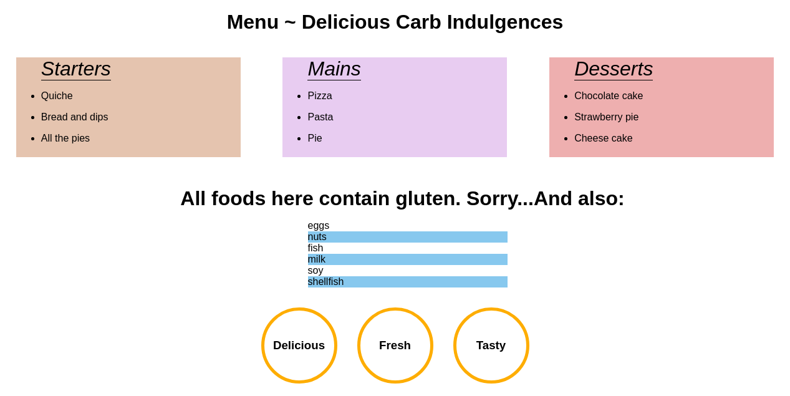

# Menu Styling

Füge mit JavaScript Styles für das Menü in `index.html` hinzu.

**Regeln**: 
* Alle Änderungen am Menü müssen in JavaScipt gemacht werden, ohne CSS!
* Die Seite muss responsive sein

**Aufgaben**: 
* Ändere die Schriftart im body-Element
* Zentriere die h1
* Die Überschriften im Menü haben die Klasse `category`. Wähle die Elemente über ihren Klassennamen auf und ändere die Eigenschaften `color` und `font-style`.
* Schreibe eine Funktion namens "_colorGenerator_", die eine zufällige Farbe zurückgibt. Wähle die Listen mit der Klasse `food-category` aus und gib jeder Liste eine andere Hintergrundfarbe mittels der Funktion, die du gemacht hast.
* Ordne die `food-category`-Listen für die Desktop-Ansicht nebeneinander an. Achte darauf, dass die Seite responsive ist und auf mobile gut aussieht.
* Wähle die Warnung unten auf der Seite über die Klasse `warning` aus. Wähle das Element aus ohne qurySelector oder querySelectorAll zu benutzen. Ändere die Textgröße und Schriftart des Elements.
* Wähle alle _geraden_ `allergy-info`-Elemente aus(jedes zweite). Gib den geraden Elementen eine andere Hintergrundfarbe
* `allergy-warning` soll als Spalte(Elemente untereinander) in der Mitte der Seite dargestellt werden.
* Die Beschreibungen im Footer sollen auch gestyled werden, mit abgerundeten Kanten, Hintergrundfarbe usw. Sie sollen untereinander bei mobile dargestellt werden und Nebeneinander bei desktop.

